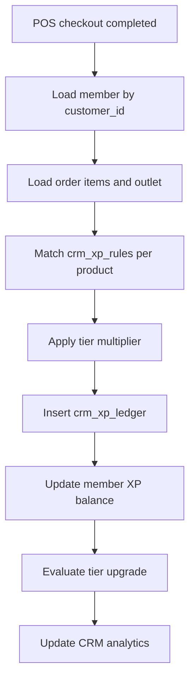
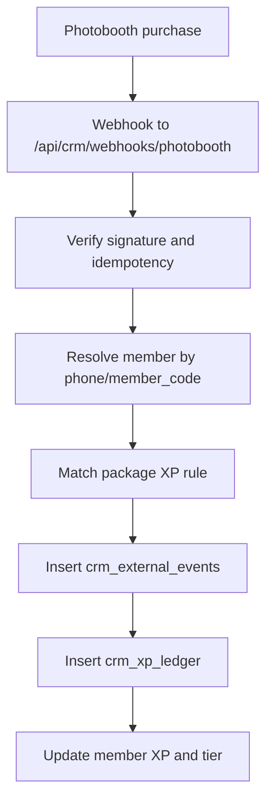
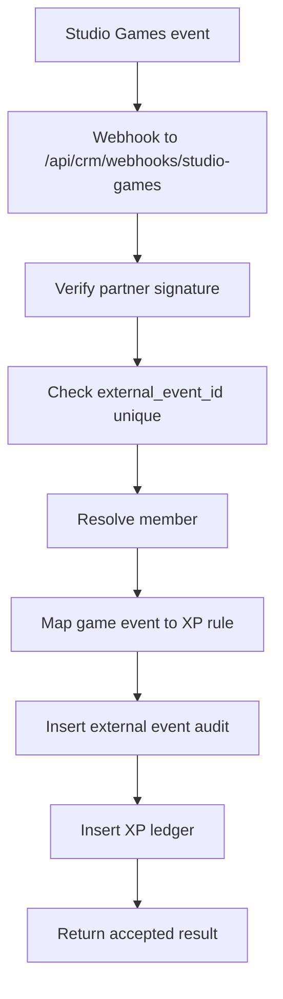

# CRM Membership and Loyalty Module Plan

## Tujuan

CRM ini akan menjadi modul besar untuk mengelola customer, member, membership tier, XP, ARK Coins, reward, avatar collectible, dan integrasi loyalty lintas channel. Modul ini tidak hanya membaca transaksi POS, tetapi menjadi loyalty engine pusat untuk semua outlet dan semua sumber aktivitas member.

Sumber aktivitas utama:

- POS transaction dari semua outlet.
- Photobooth purchase.
- Studio Games partner events.
- Manual adjustment oleh admin.
- Campaign atau bonus event.

Target utama:

- Satu profil member berlaku di semua outlet.
- XP dapat diperoleh dari produk POS, photobooth, dan game.
- XP dapat diredeem menjadi discount, merchandise, atau avatar collectible digital.
- ARK Coins tetap menjadi wallet/spending balance terpisah dari XP.
- Dashboard CRM dapat melihat member paling loyal, top spender ARK Coins, dan top spender transaksi.

## Prinsip Arsitektur

1. Gunakan `pos_customers` sebagai fondasi customer yang sudah ada.
2. Tambahkan layer CRM membership di atas customer, bukan membuat customer baru yang terpisah.
3. Semua perubahan XP harus masuk ke ledger, bukan hanya update angka balance.
4. Tier member dihitung dari lifetime metric seperti lifetime XP atau lifetime spend, bukan current XP.
5. Current XP boleh berkurang saat redemption, tetapi tier tidak otomatis turun.
6. Semua integrasi eksternal harus idempotent supaya event tidak double counted.
7. Semua outlet memakai member identity yang sama.

## Definisi Domain

### Customer

Customer adalah orang yang pernah tercatat di POS atau channel lain. Customer belum tentu menjadi member aktif.

Data minimal:

- Name
- Phone
- Email
- Birth date
- Gender optional
- Source channel
- Consent marketing
- Active status

### Member

Member adalah customer yang enroll ke membership. Member memiliki:

- Member code.
- Tier.
- XP balance.
- Lifetime XP.
- ARK Coin balance.
- Avatar profile.
- Digital collectible inventory.
- Visit and spend history.

### XP

XP adalah loyalty point. XP dapat diperoleh dari aktivitas member dan dapat ditukar dengan benefit.

XP balance dibagi menjadi:

- `current_xp`: XP yang bisa diredeem.
- `lifetime_xp`: total XP sepanjang masa untuk tiering dan loyalty score.
- `spent_xp`: total XP yang pernah diredeem.

### ARK Coins

ARK Coins adalah wallet/currency yang dipakai untuk topup dan pembayaran. ARK Coins tidak sama dengan XP.

Analytics ARK Coins perlu melacak:

- Top up amount.
- ARK Coins used for payment.
- ARK Coins balance.
- Top spender ARK Coins.

### Avatar Collectible

Avatar collectible adalah digital item yang bisa dimiliki member. Avatar dapat:

- Dipakai sebagai profile avatar.
- Didapat dengan redeem XP.
- Dibatasi per tier.
- Dibatasi stock atau periode campaign.
- Memiliki rarity.

## Membership Tier Awal

Default awal memakai 3 tier.

| Tier | Rule Awal | XP Multiplier | Benefit Awal |
| --- | --- | ---: | --- |
| Bronze | Default setelah enroll | 1.0x | Basic XP earning, basic reward |
| Silver | Lifetime XP >= 10,000 atau total spend >= 2,000,000 | 1.2x | Better reward, selected avatar |
| Gold | Lifetime XP >= 30,000 atau total spend >= 7,000,000 | 1.5x | Exclusive reward, exclusive avatar, higher discount |

Catatan:

- Angka threshold bisa disimpan di table config.
- Rule tier jangan hardcoded di UI.
- Tier upgrade dihitung setelah XP/spend ledger masuk.
- Downgrade tier sebaiknya dimatikan pada fase awal.

## XP Configuration

XP rule harus bisa dikonfigurasi admin tanpa ubah kode.

### Field XP Rule

| Field | Fungsi |
| --- | --- |
| `source_channel` | `pos`, `photobooth`, `studio_game`, `manual`, `campaign` |
| `source_type` | `product`, `package`, `game_play`, `stage_clear`, `score_threshold`, `visit`, `manual_adjustment` |
| `source_id` | ID produk, package, game, stage, atau null untuk rule global |
| `outlet_scope` | `all` atau outlet tertentu |
| `xp_mode` | `fixed`, `per_item`, `per_amount`, `multiplier`, `percentage` |
| `xp_value` | Nilai XP atau multiplier |
| `min_amount` | Minimum spend bila diperlukan |
| `max_xp_per_event` | Batas XP per event |
| `tier_multiplier_enabled` | Apakah tier multiplier berlaku |
| `starts_at` | Tanggal mulai rule |
| `ends_at` | Tanggal selesai rule |
| `is_active` | Status aktif |
| `priority` | Untuk menentukan rule bila ada lebih dari satu match |

### Contoh XP Rule

| Sumber | Rule |
| --- | --- |
| POS product A | 25 XP per item |
| POS product B | 2 XP per 10,000 spend |
| Photobooth basic | 50 XP per purchase |
| Photobooth premium | 120 XP per purchase |
| Studio Games play | 10 XP per play |
| Studio Games stage 3 clear | 75 XP |
| Studio Games high score | 150 XP |

## Struktur Database Usulan

### `crm_member_profiles`

Menghubungkan customer POS dengan identitas membership CRM.

```sql
crm_member_profiles (
  id uuid primary key,
  customer_id uuid references pos_customers(id),
  member_code text unique not null,
  tier_id uuid references crm_membership_tiers(id),
  current_xp integer not null default 0,
  lifetime_xp integer not null default 0,
  spent_xp integer not null default 0,
  loyalty_score numeric not null default 0,
  active_avatar_id uuid null,
  joined_at timestamptz not null default now(),
  last_activity_at timestamptz null,
  status text not null default 'active',
  metadata jsonb not null default '{}',
  created_at timestamptz not null default now(),
  updated_at timestamptz not null default now()
)
```

### `crm_membership_tiers`

```sql
crm_membership_tiers (
  id uuid primary key,
  code text unique not null,
  name text not null,
  rank integer not null,
  min_lifetime_xp integer not null default 0,
  min_total_spend numeric not null default 0,
  xp_multiplier numeric not null default 1,
  discount_percent numeric not null default 0,
  benefits jsonb not null default '[]',
  is_active boolean not null default true,
  created_at timestamptz not null default now(),
  updated_at timestamptz not null default now()
)
```

### `crm_xp_rules`

```sql
crm_xp_rules (
  id uuid primary key,
  name text not null,
  source_channel text not null,
  source_type text not null,
  source_id uuid null,
  outlet_id uuid null,
  xp_mode text not null,
  xp_value numeric not null,
  min_amount numeric not null default 0,
  max_xp_per_event integer null,
  tier_multiplier_enabled boolean not null default true,
  priority integer not null default 100,
  starts_at timestamptz null,
  ends_at timestamptz null,
  is_active boolean not null default true,
  metadata jsonb not null default '{}',
  created_at timestamptz not null default now(),
  updated_at timestamptz not null default now()
)
```

### `crm_xp_ledger`

Source of truth semua pergerakan XP.

```sql
crm_xp_ledger (
  id uuid primary key,
  member_id uuid references crm_member_profiles(id),
  customer_id uuid references pos_customers(id),
  direction text not null, -- earn, spend, adjust, reverse, expire
  source_channel text not null,
  source_type text not null,
  source_id uuid null,
  outlet_id uuid null,
  xp_amount integer not null,
  balance_before integer not null,
  balance_after integer not null,
  rule_id uuid references crm_xp_rules(id),
  reference_table text null,
  reference_id uuid null,
  idempotency_key text unique null,
  description text null,
  metadata jsonb not null default '{}',
  created_at timestamptz not null default now()
)
```

### `crm_rewards`

Reward yang bisa ditebus member.

```sql
crm_rewards (
  id uuid primary key,
  name text not null,
  reward_type text not null, -- discount, merchandise, avatar, voucher, custom
  xp_cost integer not null,
  required_tier_id uuid null references crm_membership_tiers(id),
  stock integer null,
  image_url text null,
  reward_data jsonb not null default '{}',
  starts_at timestamptz null,
  ends_at timestamptz null,
  is_active boolean not null default true,
  created_at timestamptz not null default now(),
  updated_at timestamptz not null default now()
)
```

### `crm_redemptions`

```sql
crm_redemptions (
  id uuid primary key,
  member_id uuid references crm_member_profiles(id),
  reward_id uuid references crm_rewards(id),
  xp_spent integer not null,
  status text not null default 'pending', -- pending, approved, fulfilled, cancelled, expired
  voucher_code text null,
  fulfilled_by uuid null,
  fulfilled_at timestamptz null,
  notes text null,
  metadata jsonb not null default '{}',
  created_at timestamptz not null default now()
)
```

### `crm_collectible_avatars`

```sql
crm_collectible_avatars (
  id uuid primary key,
  code text unique not null,
  name text not null,
  rarity text not null default 'common',
  image_url text not null,
  animation_url text null,
  xp_cost integer not null,
  required_tier_id uuid null references crm_membership_tiers(id),
  stock integer null,
  is_active boolean not null default true,
  metadata jsonb not null default '{}',
  created_at timestamptz not null default now(),
  updated_at timestamptz not null default now()
)
```

### `crm_member_avatar_inventory`

```sql
crm_member_avatar_inventory (
  id uuid primary key,
  member_id uuid references crm_member_profiles(id),
  avatar_id uuid references crm_collectible_avatars(id),
  acquired_by text not null, -- redemption, campaign, admin
  redemption_id uuid null references crm_redemptions(id),
  acquired_at timestamptz not null default now(),
  metadata jsonb not null default '{}',
  unique(member_id, avatar_id)
)
```

### `crm_integration_partners`

```sql
crm_integration_partners (
  id uuid primary key,
  code text unique not null,
  name text not null,
  partner_type text not null, -- photobooth, studio_game, other
  webhook_secret_hash text null,
  is_active boolean not null default true,
  metadata jsonb not null default '{}',
  created_at timestamptz not null default now(),
  updated_at timestamptz not null default now()
)
```

### `crm_external_events`

Event raw dari photobooth dan Studio Games. Dipakai untuk audit dan idempotency.

```sql
crm_external_events (
  id uuid primary key,
  partner_id uuid references crm_integration_partners(id),
  event_type text not null,
  external_event_id text not null,
  customer_identifier text null,
  member_id uuid null references crm_member_profiles(id),
  outlet_id uuid null,
  payload jsonb not null,
  processing_status text not null default 'pending',
  processed_at timestamptz null,
  error_message text null,
  created_at timestamptz not null default now(),
  unique(partner_id, external_event_id)
)
```

## Flow Utama

### POS Transaction XP



Catatan implementasi:

- POS single-payment flow perlu dipastikan memanggil XP engine setelah order completed.
- Split bill flow perlu mendukung XP per customer split, bukan hanya order-level customer.
- XP per produk harus disimpan di `pos_order_items.xp_earned` atau metadata ledger untuk audit.

### Photobooth XP



### Studio Games XP

Game event type awal:

- `game_play`: member hanya bermain.
- `stage_clear`: member menyelesaikan stage tertentu.
- `score_threshold`: member mencapai score tertentu.
- `mission_complete`: member menyelesaikan mission.



## Analytics CRM

### Member Paling Loyal

Rekomendasi formula `loyalty_score`:

```txt
loyalty_score =
  lifetime_xp * 0.35
  + visit_count * 20
  + total_transaction_count * 10
  + recent_activity_score
  + redemption_count * 15
```

Dashboard:

- Member paling loyal.
- Member hampir naik tier.
- Member dormant.
- Member baru minggu ini.
- Member repeat visit tertinggi.

### Top Spender ARK Coins

Sumber data:

- `pos_wallet_transactions`
- `pos_orders.ark_coins_used`

Metric:

- Total ARK Coin topup.
- Total ARK Coin used.
- Current ARK Coin balance.
- Frequency of ARK payment.

### Top Spender Transaksi

Sumber data:

- `pos_orders.total_amount`
- Filter by outlet/date/channel.

Metric:

- Total transaction spend.
- Average order value.
- Total visit.
- Last visit.
- Favorite products.

## API Structure

```txt
src/app/api/crm/customers/route.ts
src/app/api/crm/members/route.ts
src/app/api/crm/members/[id]/route.ts
src/app/api/crm/tiers/route.ts
src/app/api/crm/xp-rules/route.ts
src/app/api/crm/xp/earn/route.ts
src/app/api/crm/xp/adjust/route.ts
src/app/api/crm/rewards/route.ts
src/app/api/crm/redemptions/route.ts
src/app/api/crm/avatars/route.ts
src/app/api/crm/analytics/route.ts
src/app/api/crm/webhooks/photobooth/route.ts
src/app/api/crm/webhooks/studio-games/route.ts
```

## Frontend Structure

```txt
src/app/dashboard/crm/page.tsx
src/app/dashboard/crm/customers/page.tsx
src/app/dashboard/crm/members/page.tsx
src/app/dashboard/crm/tiers/page.tsx
src/app/dashboard/crm/xp-rules/page.tsx
src/app/dashboard/crm/rewards/page.tsx
src/app/dashboard/crm/avatars/page.tsx
src/app/dashboard/crm/integrations/page.tsx
src/app/dashboard/crm/analytics/page.tsx

src/modules/crm/components/
src/modules/crm/hooks/
src/modules/crm/lib/xp-engine.ts
src/modules/crm/lib/tier-engine.ts
src/modules/crm/types.ts
```

## Dashboard CRM

Halaman utama CRM:

- Total customers.
- Total members.
- Active members.
- New members this month.
- Total XP issued.
- Total XP redeemed.
- Total ARK Coins topup.
- Total ARK Coins spent.
- Most loyal members.
- Top spender ARK Coins.
- Top spender transactions.
- XP source breakdown.
- Redemption pending.

## Integration Security

Untuk photobooth dan Studio Games:

- Wajib pakai partner API key atau webhook signature.
- Wajib punya `external_event_id`.
- Wajib idempotency check.
- Payload raw disimpan di `crm_external_events`.
- Jika processing gagal, event status menjadi `failed`.
- Event bisa di-retry oleh admin.

Signature header yang disarankan:

```txt
X-Arkiv-Partner-Code
X-Arkiv-Event-Id
X-Arkiv-Signature
X-Arkiv-Timestamp
```

## Implementation Roadmap

### Implementation Status

- 2026-05-22: Phase 1 foundation mulai dikerjakan.
- Migration dibuat: `supabase/migrations/20260522063106_crm_membership_loyalty_foundation.sql`.
- API dasar dibuat untuk CRM dashboard, members, tiers, XP rules, dan rewards.
- Halaman awal CRM dibuat di `/dashboard/crm` dan launcher CRM di Arkiv OS sudah aktif.
- 2026-05-22: Phase 2 POS integration mulai dikerjakan.
- Migration POS XP dibuat: `supabase/migrations/20260522064730_crm_pos_xp_integration.sql`.
- Loyalty engine dibuat di `src/lib/crm/loyalty-engine.ts` untuk award XP, idempotency ledger, sync customer XP, dan tier upgrade.
- POS single-payment, open bill payment, dan split payment sudah memanggil CRM XP engine.
- API produk POS sudah menerima field `xp` sebagai alias untuk `xp_points` dan tetap backward-compatible jika database aktif belum punya kolom tersebut.
- 2026-05-22: Phase 3 mulai dikerjakan.
- Halaman CRM Members dibuat di `/dashboard/crm/members` dengan list member/customer, filter, summary XP/spend, detail panel, dan XP history.
- API detail member dibuat di `/api/crm/members/[id]` untuk membaca profile, XP ledger, dan recent POS orders.
- Detail member dipindahkan menjadi page sendiri di `/dashboard/crm/members/[id]`.
- Halaman Rewards Catalog dibuat di `/dashboard/crm/rewards` untuk list, filter, create/update reward, XP cost, required tier, stock, dan active status.

### Phase 1 - Foundation

- Buat migration CRM loyalty tables.
- Seed 3 tier default: Bronze, Silver, Gold.
- Seed beberapa XP rules default.
- Buat API dasar member, tier, XP rules, rewards.
- Buat dashboard CRM placeholder dengan data nyata dari POS customer.

### Phase 2 - POS Integration

- Tambahkan XP rule per `pos_products`.
- Hook POS checkout completed ke CRM XP engine.
- Pastikan XP ledger tercatat untuk order normal dan split bill.
- Buat top spender transaction dari `pos_orders`.
- Buat top ARK spender dari wallet/order usage.

### Phase 3 - Rewards and Avatar

- Buat reward catalog.
- Buat redemption flow.
- Buat collectible avatar catalog.
- Buat member avatar inventory.
- Buat active avatar selector.

### Phase 4 - Photobooth Integration

- Buat partner config photobooth.
- Buat webhook endpoint.
- Buat XP rules untuk package photobooth.
- Buat audit external event.

### Phase 5 - Studio Games Integration

- Buat partner config Studio Games.
- Buat event type: play, stage clear, score threshold, mission complete.
- Buat webhook endpoint dengan signature.
- Buat XP rules per game/stage/event.
- Buat leaderboard game-to-CRM.

### Phase 6 - Analytics and Automation

- Member loyalty score.
- Dormant member detection.
- Campaign segment.
- Reward performance.
- Outlet comparison.
- XP fraud/anomaly detection.

## Catatan Integrasi Dengan Sistem Saat Ini

Yang sudah ada dan perlu dimanfaatkan:

- `pos_customers` untuk data customer/member awal.
- `pos_orders` untuk transaksi POS.
- `pos_order_items` untuk produk per transaksi.
- `pos_products` untuk master produk POS.
- `pos_wallet_transactions` untuk topup ARK Coins.
- `ark_coin_balance`, `total_xp`, `current_xp`, `visit_count`, dan `membership_tier` di customer existing.

Perhatian:

- Jangan membuat dua sumber kebenaran untuk customer.
- Jangan menghitung XP hanya dari total order jika requirement-nya XP per produk.
- Jangan update XP balance tanpa ledger.
- Untuk multiple outlet, semua transaksi harus membawa `outlet_id` atau `branch_id`.
- Untuk Studio Games dan photobooth, event harus idempotent.

## Open Questions

Hal yang perlu diputuskan sebelum implementasi detail:

1. Apakah tier dihitung dari lifetime XP saja, total spend saja, atau kombinasi?
2. Apakah redemption discount langsung membuat voucher code atau langsung bisa dipakai di POS?
3. Apakah avatar collectible punya stock terbatas?
4. Apakah XP bisa expired?
5. Apakah ARK Coins bisa ditukar menjadi XP atau tetap terpisah total?
6. Apakah membership berlaku global brand atau per brand/outlet group?
7. Apakah member bisa punya lebih dari satu phone/email?

## Rekomendasi Keputusan Awal

- Tier memakai kombinasi lifetime XP dan total transaction spend.
- XP tidak expired di fase awal.
- ARK Coins dan XP tetap terpisah.
- Redemption discount menghasilkan voucher code yang bisa dipakai di POS.
- Avatar collectible memakai XP redemption dan masuk inventory digital.
- Membership berlaku global untuk semua outlet.
- Customer identity utama memakai phone number, dengan email sebagai optional.
